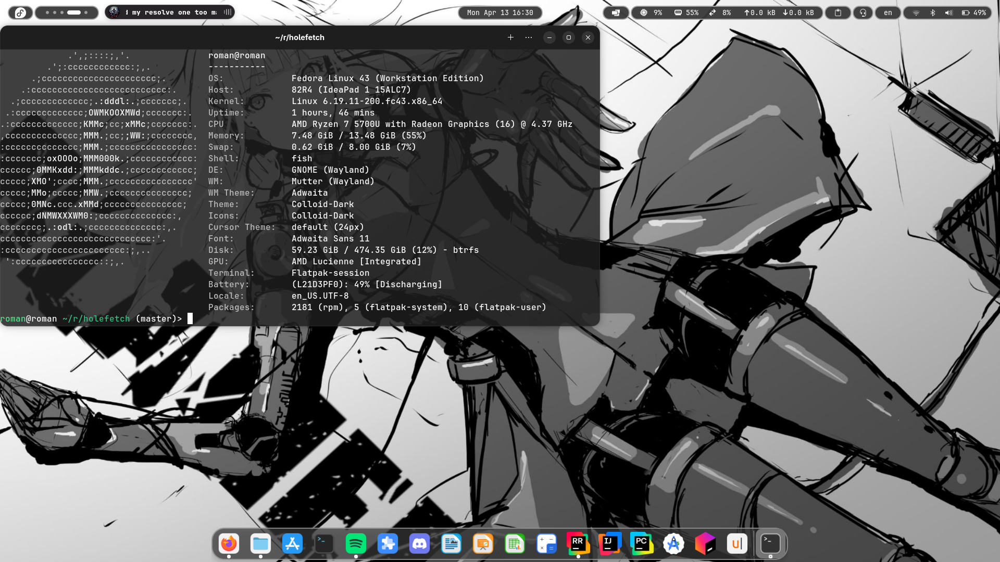
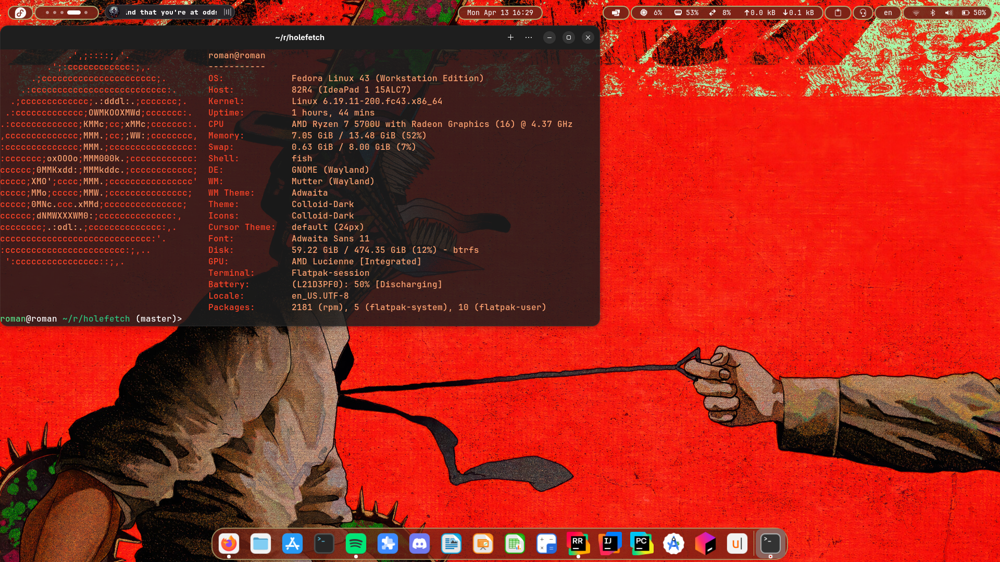

# holefetch

A Linux system fetch tool that automatically themes itself from your wallpaper.





---

## Why holefetch?

Ever run fastfetch and wished it matched your desktop without touching a config file?
Holefetch does exactly that, it extracts the dominant colours from your wallpaper
and applies them to the logo and info output automatically.

Holefetch is designed for users of traditional desktop environments — GNOME, KDE,
XFCE, MATE, and Cinnamon. If you are running a tiling window manager with a custom
rice, fastfetch gives you the level of control you probably want. holefetch exists
for everyone else — the user who just wants a fetch tool that looks good with their
desktop without any configuration.

> Holefetch is inspired by fastfetch and neofetch, and reuses fastfetch's ASCII
> logo collection at build time. If you need deep customisation, fastfetch is the
> right tool. Holefetch exists for everyone else.

---

## Desktop Environment Support

| DE        | Wallpaper Detection | Tested |
|-----------|--------------------:|-------:|
| GNOME     | ✓                   | ✓      |
| KDE       | ✓ (best-effort)     | ✗      |
| XFCE      | ✓ (best-effort)     | ✗      |
| MATE      | ✓ (best-effort)     | ✗      |
| Cinnamon  | ✓ (best-effort)     | ✗      |

holefetch was developed and tested on Fedora Linux with GNOME. Support for other
desktop environments is implemented but not personally verified. If you encounter
issues on a specific DE, please open a GitHub issue.

---

## Installation

### Build from source (requires Rust)

```bash
git clone https://github.com/roman11x/holefetch
cd holefetch
cargo build --release
```

Then either run it directly:
```bash
./target/release/holefetch
```

Or move it to a directory in your PATH for system-wide access:
```bash
mv target/release/holefetch ~/.local/bin/
```

### Binary release

Pre-compiled binaries are available on the
[GitHub Releases](https://github.com/roman11x/holefetch/releases) page.
Download the binary for your architecture, make it executable, and move it to your PATH:

```bash
chmod +x holefetch
mv holefetch ~/.local/bin/
```

> `cargo install holefetch` will be available once the crate is published to crates.io.

---

## Usage

Run holefetch with no arguments for normal output:

```bash
holefetch
```

### CLI Flags

| Flag | Description |
|------|-------------|
| `--list-logos` | Print all available logo names and exit |
| `--preview-logo <name>` | Run with a specific logo for this run only, without saving |
| `--set-logo <name>` | Set the logo permanently in config.toml |
| `--wallpaper-path <path>` | Override wallpaper detection and save to config.toml |

Examples:

```bash
# list all available logos
holefetch --list-logos

# preview the arch logo without saving
holefetch --preview-logo arch

# set the logo to cachyos permanently
holefetch --set-logo cachyos

# set a custom wallpaper path
holefetch --wallpaper-path ~/Pictures/wallpaper.jpg
```

---

## Configuration

holefetch reads its configuration from `~/.config/holefetch/config.toml`.
The file is created automatically when you use `--set-logo` or `--wallpaper-path`.
You can also create and edit it manually.

If the file does not exist, holefetch runs with all defaults —
auto-detected logo, auto-detected wallpaper, all modules shown.

### Full config schema

```toml
# ~/.config/holefetch/config.toml

# Override the auto-detected distro logo.
# Must be a valid logo name from --list-logos.
# logo = "arch"

# Override the auto-detected wallpaper path.
# wallpaper_path = "/home/you/Pictures/wall.jpg"

# Palette brightness multiplier.
# Default is 1.0. Range is 0.0–2.0.
# 0.8 = slightly darker, 1.2 = slightly lighter.
# brightness = 1.0

[modules]
# Control which fields are shown and in what order.
# Remove any entry to hide that field.
# Reorder entries to change display order.
show = [
    "os",
    "host",
    "kernel",
    "uptime",
    "cpu",
    "memory",
    "swap",
    "shell",
    "de",
    "disk",
    "gpu",
    "terminal",
    "battery",
    "locale",
    "packages",
    "ip"
]
```

### Available module names

| Name | Field |
|------|-------|
| `os` | Operating system |
| `host` | Host/machine model |
| `kernel` | Kernel version |
| `uptime` | System uptime |
| `cpu` | CPU model and speed |
| `memory` | RAM usage |
| `swap` | Swap usage |
| `shell` | Current shell |
| `de` | Desktop environment, WM, theme, icons, cursor, font |
| `disk` | Root partition disk usage |
| `gpu` | GPU model |
| `terminal` | Terminal emulator |
| `battery` | Battery status |
| `locale` | System locale |
| `packages` | Installed package count |
| `ip` | Local IP address |

---

## Adding wallpaper detection for other desktop environments

holefetch detects the wallpaper path by running DE-specific commands.
The detection logic lives in `src/colour.rs` in the `detect_wallpaper` function.

To add support for a new DE or window manager:

**1.** Find the command that returns your WM's current wallpaper path.
For example, for a hypothetical WM called `mywm`:
```bash
mywm --get-wallpaper
```

**2.** Add a new match arm in `detect_wallpaper`:
```rust
"MyWM" => {
    if let Ok(output) = Command::new("mywm")
        .args(["--get-wallpaper"])
        .output()
    {
        let stdout = String::from_utf8_lossy(&output.stdout).trim().to_string();
        if !stdout.is_empty() {
            return Some(stdout);
        }
    }
    None
}
```

**3.** The `de` parameter comes from `desktop_environment.name` in `SystemInfo`,
which is read from the `XDG_CURRENT_DESKTOP` environment variable.
Make sure your match arm string matches what your DE sets for that variable.

**4.** Open a pull request — contributions for new DE support are welcome!

---
---

## Name

holefetch is named after the Hole, the lawless, magic-free slum at the centre of
Q. Hayashida's manga *Dorohedoro*. Just as every sorcerer in Dorohedoro has their
own unique door to the Hole, holefetch gives every user a fetch tool with its own
unique colours derived from their wallpaper.

---

## Credits

- ASCII logos sourced from [fastfetch](https://github.com/fastfetch-cli/fastfetch)
  at compile time via the GitHub API
- Inspired by [fastfetch](https://github.com/fastfetch-cli/fastfetch)
  and [neofetch](https://github.com/dylanaraps/neofetch)

---

## License

MIT